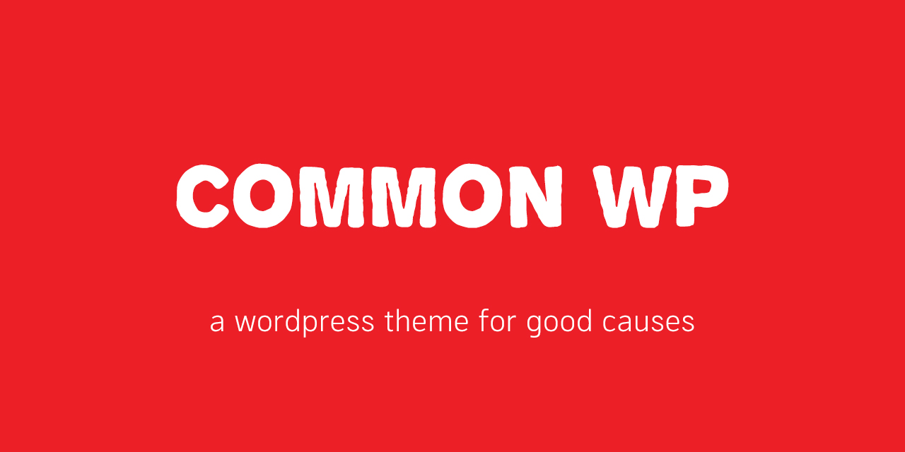

# Common WP

This is a wordpress theme for non-profit use. It's focus is on simple visual design, and clean componentized code for easy customization by organizations with diverse needs.

## Requirements

In order to use this theme fully you need to install the [[Common WP Blocks]](https://github.com/jcklpe/common-wp-blocks) plugin and the [[The Events Calendar]](https://wordpress.org/plugins/the-events-calendar/). In order to make edits to the theme you need to have a basic familiarity with [cli](https://www.youtube.com/watch?v=4RPtJ9UyHS0&t=), [npm](https://www.npmjs.com/), and [gulp](https://gulpjs.com/),

## Build Process

This theme uses a gulp build system.

To build the theme you just need to install the package manager [npm](https://www.npmjs.com/) and run `npm install` in the theme root folder then run `gulp build` to build a new version of the `build` files.

You can also use the command `gulp watch` to watch the `src` folder for any changes to the files as you work so that it can seamlessly build new versions of the build files in the background.

## TODO:

- [x] componentize out scss parts and reorganize build process
- [x] replace all hardcoded logos with global custom fields
- [x] replace all hardcoded text with global custom fields
- [x] convert all custom template blocks into template partials
- [x] white label all organizational references
- [x] break out block components into a separate companion plugin
- [ ] complete [blocks companion plugin](https://github.com/jcklpe/common-wp-blocks).
- [ ] re-align php templates in light of more flexible blocks based page building project.
- [ ] Build theme scss to "overlay" the default styling of the block companion plugin to make this easier for people to customize for other contexts
- [ ] convert build process to gulp 4
- [ ] Lots of other stuff

## License

licensed under Cooperative Work License v 1.0
